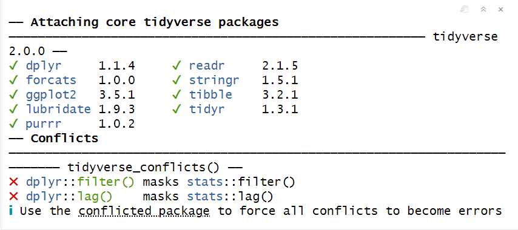

---
title:"ggplot"
author:"ssw"
date:"2024-06-04"
output:html_document
---

### 安装数据分析包

数据科学流程环节：


可以表述为数据导入、数据规整、数据处理、可视化、建模以及形成可重复性报告，整个分析和探索过程都在一个程序代码中完成，这种方式对训练我们的数据思维非常有帮助。

{width="517"}

```{r}
#安装
#install.packages("tidyverse")
#导入tidyverse包
library("tidyverse")
```

可能会存在下图情况：

{width="486"}

#### 冲突的产生以及处理

存在命名空间的概念，避免冲突的方式可以提前通过`conflicted`包设置`preference`

```{r}
#install.packages("conflicted")
library(conflicted)

#设置冲突处理策略
conflicted::conflict_prefer("filter","dplyr")
conflicted::conflict_prefer("lag","dplyr")
```

其他处理冲突的方式：

...

### ggplot使用

#### 初次使用测试

使用`ggplot2::msg`检验使用效果。其数据包含了美国环境保护协会收集的38种车型的观测数据，如果想要明确指出某个函数（或数据集）的来源，那么可以使用特殊语法形式`package::function()`。

Q：数据结构类型为？

```{r}
ggplot2::mpg

?mpg
```

#### 创建`ggplot`

-   `ggplot()`开始绘图，创建坐标系，可以继续添加图层，意义指明数据集

-   `geom_point()`即为向图层中添加一张散点图图层，创建一张散点图，可以理解为几何对象函数，每个几何对象函数都有一个`mapping`参数，且`aes`参数总与`mapping`参数在一起出现，表达一种映射关系

-   注意：参数以及函数的区别：

    `function(parameter)`

    -   `function`:函数名

    -   `parameter`：参数名

```{r}
ggplot(data = mpg) + 
  geom_point(mapping = aes(x = displ, y = hwy))
```

#### 模板使用

可重用的ggplot2绘图模板：

```{r}
# ggplot(data = <DATA>) + 
#   <GEO_FUNCTION>(mapping = aes(<MAPPINGS>))
```

##### 练习1

```{r}
# (1)运行 ggplot(data = mpg)，你会看到什么？

# (2) 数据集 mpg 中有多少行？多少列？

# (3) 变量 drv 的意义是什么？使用 ?mpg 命令阅读帮助文件以找出答案。

# (4) 使用 hwy 和 cyl 绘制一张散点图。

# (5) 如果使用 class 和 drv 绘制散点图，会发生什么情况？为什么这张图没什么用处？
```

#### 图形的其他属性映射

改变`points`的大小或者颜色等信息，从`aes`函数对应参数下手：

-   颜色映射：

    ```{r}
    ggplot(data = mpg) +
      geom_point(mapping = aes(x = displ, y = hwy, color = class))
    ```

-   尺度映射

    ```{r}
    # 为什么警告？
    ggplot(data = mpg) +
      geom_point(mapping = aes(x = displ, y = hwy, size = class))
    ```

-   透明度映射

    ```{r}
    ggplot(data = mpg) +
      geom_point(mapping = aes(x = displ, y = hwy, alpha = class))
    ```

-   形状映射

    ```{r}
    ggplot(data = mpg) +
      geom_point(mapping = aes(x = displ, y = hwy, shape = class))
    ```

-   注意：

    `aes`函数参数重点在于关联图像属性以及变量之间的映射关系，相反，手动设置图像节点为蓝色时：

    ```{r}
    ggplot(data = mpg) +
      geom_point(mapping = aes(x = displ, y = hwy), color = "blue")
    ```

    此时颜色不传达变量信息，只改变图形外观，这是图形属性可以作为几何函数的一个参数，需要在`aes`函数外部进行设置。此外，还需要为这个图形属性选择一个有意义的值。

    -   颜色是一个字符串

    -   点大小使用毫米标注

    -   点的形状是一个数值

##### 练习2

```{r}
# (1) 以下这段代码有什么错误？为什么点不是蓝色的？
ggplot(data = mpg) +
  geom_point(
    mapping = aes(x = displ, y = hwy, color = "blue")
  )

# (2) mpg 中的哪些变量是分类变量？哪些变量是连续变量？（提示：输入 ?mpg 来阅读这个数据集的文档。）当调用 mpg 时，如何才能看到这些信息？

# (3) 将一个连续变量映射为 color、size 和 shape。对分类变量和连续变量来说，这些图形属性的表现有什么不同？

# (4) 如果将同一个变量映射为多个图形属性，会发生什么情况？

# (5) stroke 这个图形属性的作用是什么？它适用于哪些形状？（提示：使用 ?geom_point 命令。）

# (6) 如果将图形属性映射为非变量名对象，比如 aes(color = displ < 5)，会发生什么情况？

```

#### 分面数据

对于离散变量利用其成为图像属性，分割为多个分面，分别显示数据子集的子图，对单个变量使用分面即使用函数`facet_warp()`，比较特别的是第一个参数即为分面的变量：

```{r}
ggplot(data = mpg) +
  geom_point(mapping = aes(x = displ, y = hwy)) +
    facet_wrap(~ class, nrow = 2)

# 对多个变量进行分面
ggplot(data = mpg) +
  geom_point(mapping = aes(x = displ, y = hwy)) +
    facet_grid(. ~ cyl)

?facet_wrap
```

##### 练习3

```{r}
#(1) 如果使用连续变量进行分面，会发生什么情况？

#(2) 在使用 facet_grid(drv ~ cyl) 生成的图中，空白单元的意义是什么？它们和以下代码生成的图有什么关系？
ggplot(data = mpg) +
  geom_point(mapping = aes(x = drv, y = cyl))

#(3) 以下代码会绘制出什么图？ . 的作用是什么？
ggplot(data = mpg) +
  geom_point(mapping = aes(x = displ, y = hwy)) +
    facet_grid(drv ~ .)

ggplot(data = mpg) +
  geom_point(mapping = aes(x = displ, y = hwy)) +
    facet_grid(. ~ cyl)

#(4) 查看本节的第一个分面图：
ggplot(data = mpg) +
  geom_point(mapping = aes(x = displ, y = hwy)) +
    facet_wrap(~ class, nrow = 2)
#与使用图形属性相比，使用分面的优势和劣势分别是什么？如果有一个更大的数据集，你将如何权衡这两种方法的优劣？

# (5) 阅读 ?facet_wrap 的帮助页面。nrow 和 ncol 的功能分别是什么？还有哪些选项可以控制分面的布局？为什么函数 facet_grid() 没有变量 nrow 和 ncol ？

# (6) 在使用函数 facet_grid() 时，一般应该将具有更多唯一值的变量放在列上。为什么这么做呢？

```

#### 几何对象

上部分讨论的内容基本包含的都是关于数据信息的映射关系，该部分着重分析图像的呈现形式

```{r}
# 左图
ggplot(data = mpg) +
geom_point(mapping = aes(x = displ, y = hwy))
# 右图
ggplot(data = mpg) +
geom_smooth(mapping = aes(x = displ, y = hwy))
```

上述映射关系在此处不一定同时适用，比如点的形状在此处设置线的形状显得不合理，但可以设置线型如

```{r}
ggplot(data = mpg) +
  geom_smooth(mapping = aes(x = displ, y = hwy, linetype = drv))
```

特定几何对象学习可以使用帮助获取，此外需要再图上显示多个几何对象即可进行同步的添加：

```{r}
ggplot(data = mpg) +
  geom_point(mapping = aes(x = displ, y = hwy)) +
  geom_smooth(mapping = aes(x = displ, y = hwy))
```

此处可以进行一定的优化，引入全局变量`global variable`以及局部变量`local variable`的概念：

```{r}
ggplot(data = mpg, mapping = aes(x = displ, y = hwy)) +
  geom_point() +
  geom_smooth()
```

此处其实使用了部分继承`extend`或者参数传递的概念，反之，局部变量的映射关系会覆盖全局（更加高效的在不同图层使用不同图形属性）：

```{r}
ggplot(data = mpg, mapping = aes(x = displ, y = hwy)) +
  geom_point(mapping = aes(color = class)) +
  geom_smooth()
```

Q：能不能为不同图层指定不同数据呢？

##### 练习4

```{r}
# (1) show.legend = FALSE 的作用是什么？se参数意义是什么
ggplot(
  data = mpg,
  mapping = aes(x = displ, y = hwy, color = drv)
) +
  geom_point() +
  geom_smooth(se = FALSE, show.legend = TRUE)

# (2) 以下代码生成的两张图有什么区别吗？为什么？
ggplot(data = mpg, mapping = aes(x = displ, y = hwy)) +
  geom_point() +
  geom_smooth()

ggplot() +
  geom_point(
    data = mpg,
    mapping = aes(x = displ, y = hwy)
  ) +
  geom_smooth(
    data = mpg,
    mapping = aes(x = displ, y = hwy)
  )
```

#### 统计变换

```{r}
ggplot(data = diamonds) +
  geom_bar(mapping = aes(x = cut))

```

几何对象的作用：

-   对原始数据进行绘制，如`geom_point()`等

-   对原始数据进行二次加工生成新数据进行绘制，如`geom_smooth`、`geom_bar`等

绘图时为了计算新数据的算法称为`stat(statistical transformation, 统计变换)`，如`geom_bar()`的统计变换过程：

1.  由原始数据进行处理
2.  使用数量特征对特定数据列进行计算并返回新的数据集
3.  利用`cut`以及新计算的`count`进行映射绘制

可以通过查看`geom_bar`的默认值推得几何对象函数使用了哪一类统计变换，或者说统计变换函数可以和几何对象函数互换使用：

```{r}
ggplot(data = diamonds) +
  stat_count(mapping = aes(x = cut))
```

可以讲每一个几何对象函数均有对应的统计变换，显式的使用统计变换即为更高维度的做法：

-   覆盖之前的统计变换方法

    ```{r}
    demo <- tribble(
      ~a,~b,
      "bar_1", 20,
      "bar_2", 30,
      "bar_3", 40
    )
    ggplot(data = demo) +
      geom_bar(
        mapping = aes(x = a, y = b), 
        stat = "identity"
      )
    ```

-   更强调`summary`统计量

    ```{r}
    ggplot(data = diamonds) +
      stat_summary(
        mapping = aes(x = cut, y = depth),
        fun.ymin = min,
        fun.ymax = max,
        fun.y = median
      )

    ?stat_summary()
    ```

##### 练习5

```{r}
# (1) geom_col() 函数的功能是什么？它和 geom_bar() 函数有何不同？


# (2) 多数几何对象和统计变换都是成对出现的，总是配合使用。仔细阅读文档，列出所有成对的几何对象和统计变换。它们有什么共同之处？


# (3) stat_smooth() 函数会计算出什么变量？哪些参数可以控制它的行为？

```
